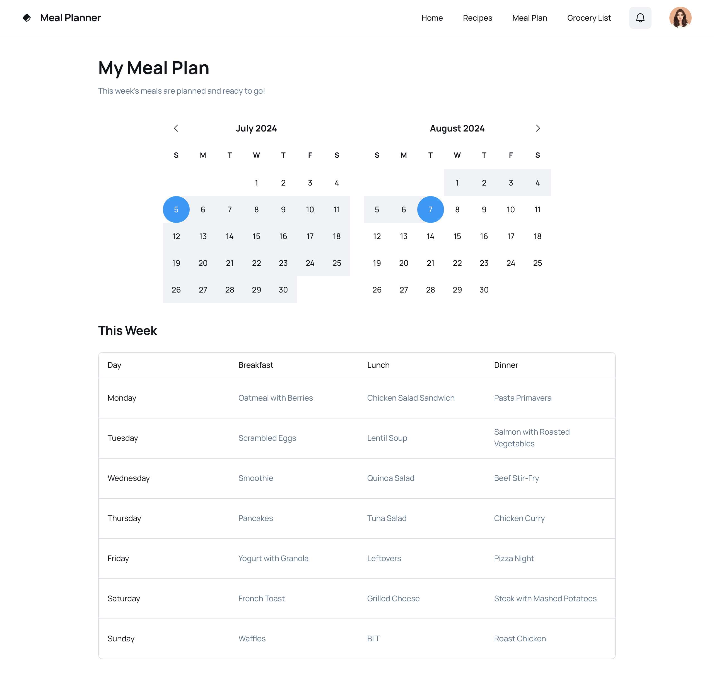
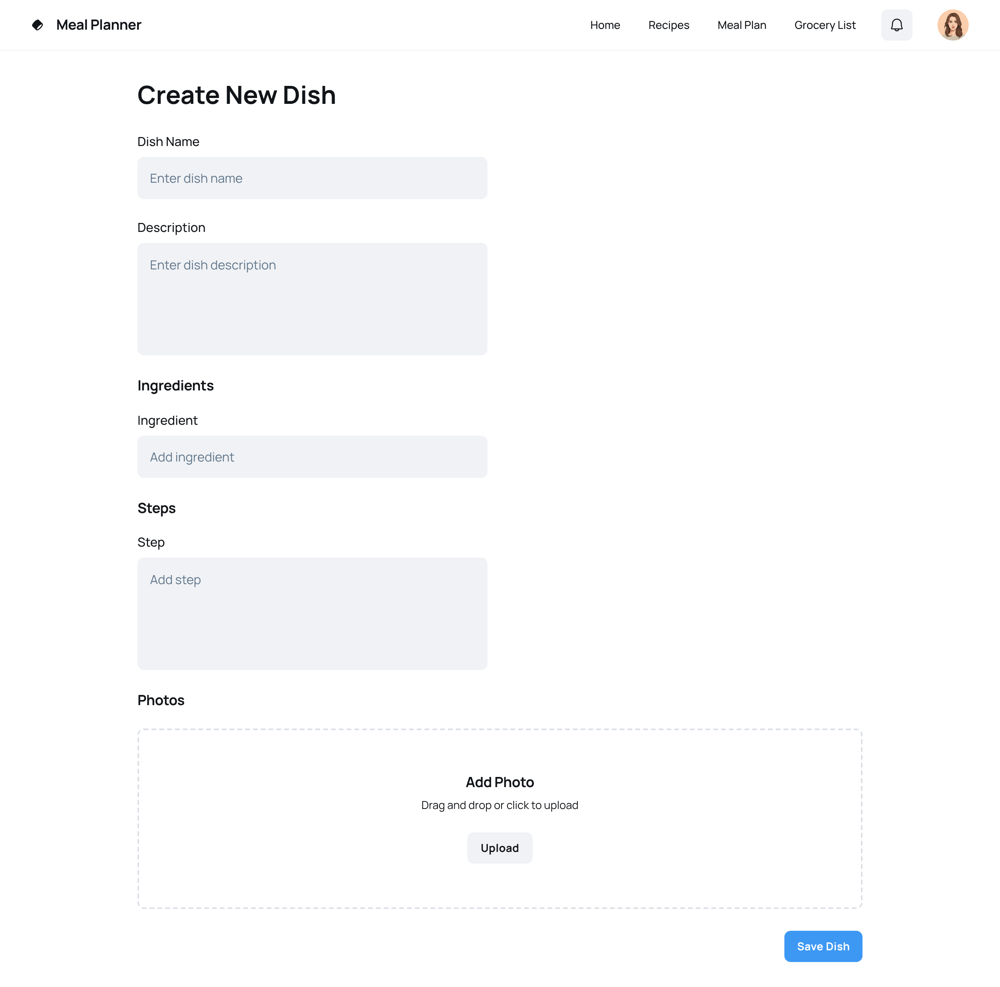
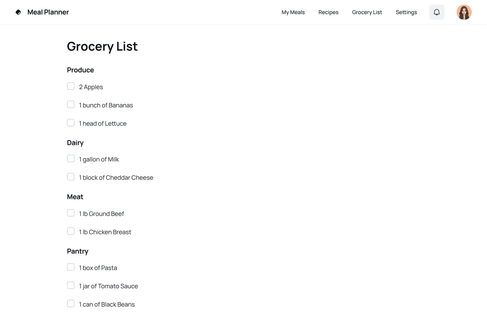

# Sistema JSON Simple para Estudiantes

Este proyecto ha sido simplificado para estudiantes. Ahora utiliza un objeto JSON simple en memoria con una arquitectura en capas clara y separada.

## 📁 Estructura del Proyecto

```
src/
├── types/
│   ├── database.ts      # Define el objeto JSON con los datos
│   ├── category.ts      # Interface para categorías
│   └── paciente.ts      # Interface para pacientes
├── repositories/        # 🆕 Capa de acceso a datos
│   ├── categoryRepository.ts    # CRUD para categorías
│   ├── pacienteRepository.ts    # CRUD para pacientes
│   └── index.ts
├── services/            # Capa de lógica de negocio
│   ├── categoryService.ts       # Lógica de negocio de categorías
│   ├── pacienteService.ts       # Lógica de negocio de pacientes
│   └── index.ts
└── presentations/       # Capa de presentación (sin cambios)
```

## 🏗️ Arquitectura en 3 Capas

### 1. **📊 Capa de Datos (Repositories)**
- **Responsabilidad**: Manejo directo del objeto JSON
- **Archivos**: `repositories/categoryRepository.ts`, `repositories/pacienteRepository.ts`
- **Qué hace**: CRUD básico, búsquedas, conteos

```typescript
// Ejemplo: CategoryRepository
export class CategoryRepository {
  static getAll(): Category[] { /* ... */ }
  static findById(id: number): Category | undefined { /* ... */ }
  static create(data: CategoryInput): Category { /* ... */ }
  static update(id: number, updates: CategoryUpdate): Category | null { /* ... */ }
  static delete(id: number): boolean { /* ... */ }
  static count(): number { /* ... */ }
}
```

### 2. **⚙️ Capa de Servicios (Services)**
- **Responsabilidad**: Lógica de negocio y orquestación
- **Archivos**: `services/categoryService.ts`, `services/pacienteService.ts`
- **Qué hace**: Validaciones, logs, reglas de negocio, usa repositories

```typescript
// Ejemplo: CategoryService
export class CategoryService {
  static async getAll(): Promise<Category[]> {
    console.log('📋 Obteniendo todas las categorías...')
    const categories = CategoryRepository.getAll()
    console.log(`✅ ${categories.length} categorías obtenidas`)
    return categories
  }
  // ... más métodos
}
```

### 3. **🖥️ Capa de Presentación (Presentations)**
- **Responsabilidad**: Interfaz de usuario
- **Archivos**: `presentations/CategoryPresentation.ts`, etc.
- **Qué hace**: Maneja DOM, eventos, llama a los services

## 🎯 ¿Qué cambió?

- ✅ **Separación por responsabilidades**: Cada capa tiene un propósito claro
- ✅ **Un archivo por entidad**: CategoryRepository, PacienteRepository
- ✅ **Fácil de entender**: Cada archivo es pequeño y específico
- ✅ **Escalable**: Agregar nuevas entidades es simple
- ✅ **Misma API en services**: No se rompe el código existente

## 📊 Base de Datos JSON

La "base de datos" sigue siendo un objeto simple en `src/types/database.ts`:

```typescript
export const database: JsonDatabase = {
  categories: [
    { id: 1, description: 'Medicina General', created_at: '2024-01-01' },
    { id: 2, description: 'Pediatría', created_at: '2024-01-01' },
    // ...
  ],
  pacientes: [
    {
      id: 1,
      nombre: 'Juan Carlos',
      apellido: 'González',
      // ...
    },
    // ...
  ]
}
```

## 🔧 Cómo Usar

### 1. **Desde Services** (Recomendado para presentaciones)
```typescript
import { CategoryService, PacienteService } from './services'

// Obtener todos
const categories = await CategoryService.getAll()
const pacientes = await PacienteService.getAll()

// Operaciones específicas
const paciente = await PacienteService.getById(1)
const pacientsFilter = await PacienteService.searchByName('Juan')
const mujeres = await PacienteService.getByGender('Femenino')
```

### 2. **Desde Repositories** (Para lógica de datos directa)
```typescript
import { CategoryRepository, PacienteRepository } from './repositories'

// Acceso directo a datos (sin logs)
const categories = CategoryRepository.getAll()
const count = CategoryRepository.count()
const paciente = PacienteRepository.findById(1)
```

## 📚 Ventajas Educativas

### **Para Estudiantes:**
1. **Separación clara**: Cada capa tiene una responsabilidad específica
2. **Fácil de encontrar**: ¿Necesitas CRUD? → Repository. ¿Lógica? → Service
3. **Escalable**: Agregar `ProductRepository` es copiar y adaptar
4. **Patrones reales**: Repository pattern se usa en la industria
5. **Debugging simple**: Los logs están en Services, la data en Repositories

### **Para Profesores:**
- Enseñar **responsabilidades únicas** por archivo
- Mostrar **flujo de datos**: Presentation → Service → Repository → JSON
- Explicar **inyección de dependencias** conceptualmente
- Demostrar **testing** por capas

## 🚀 Agregar Nueva Entidad

Para agregar, por ejemplo, "Doctores":

1. **Crear interface**: `types/doctor.ts`
2. **Agregar al JSON**: `types/database.ts`
3. **Crear repository**: `repositories/doctorRepository.ts`
4. **Crear service**: `services/doctorService.ts`
5. **Crear presentation**: `presentations/DoctorPresentation.ts`

## ⚠️ Importante

- **Los datos se pierden al recargar** - Es temporal para aprender
- **No hay persistencia** - Enfócate en la arquitectura
- **Logs informativos** - Ayudan a ver el flujo de datos
- **Código simple** - Sin complejidades innecesarias

¡Perfecto para aprender arquitectura limpia y separación de responsabilidades! 🎓 


## A continuación la explicación de lo desarrollado en el repositorio:
## Aplicación para la planificación alimenticia de tu familia

La primera imagen muestra lo que un usuario debe observar cuando accede a su app. Lo que su familia disfrutará el día de hoy.


La segunda imagen es la planificación que la puede realizar cualquier miembro adulto de la familia. Al escoger un rango de fechas el usuario puede asignar que plato se servirá en esos días tanto en desayuno, como almuerzo y merienda.



En la tercera imagen se muestra como se crea un nuevo plato, incluyendo el detalle de los ingredientes del mismo.



En la cuarta imagen apreciamos como la aplicación puede mostrar también el mismo plato en otro formato de visualización y permitiendo que los miembros de la familia comenten sobre el mismo.


En la quinta imagen podemos apreciar que en base a los ingredientes de estos platos escogidos por un periodo específico es posible conocer un detalle de los producto que se van a requerir y así armar su lista de compras.



Tomar en cuenta todos los atributos que aunque no explícitos en las imágenes te ayudarán a estructurar tus objetos y sus relaciones. 
